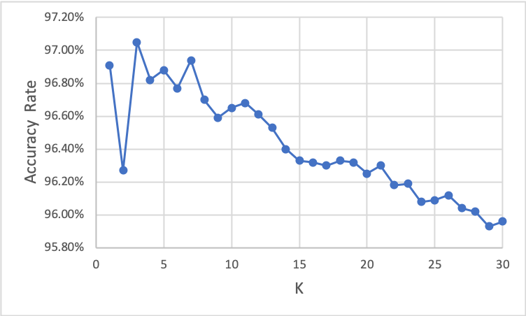
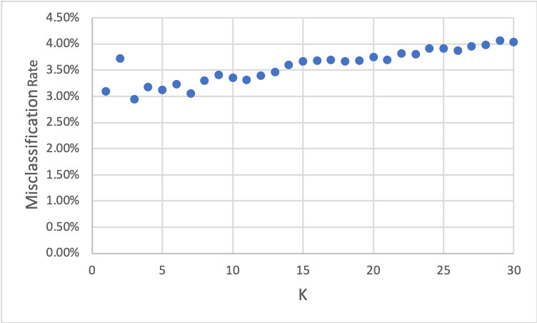
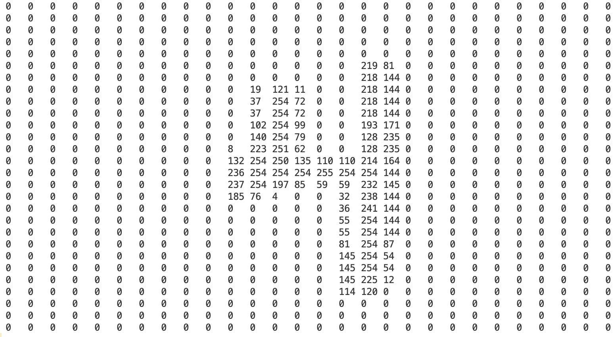
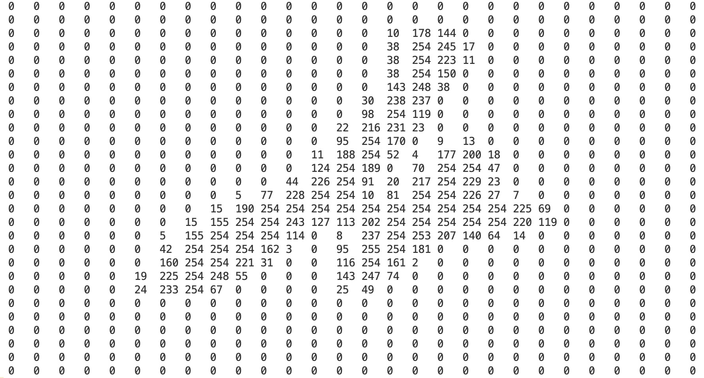
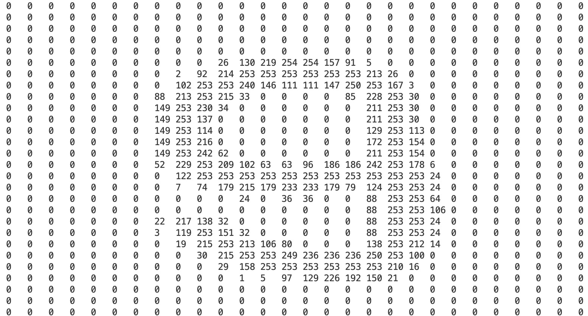

# K-Nearest Neighbor

## Key steps

1. Get Training set (including training images and their labels) from MNIST.

``` C++
bool get_train_images_with_label_from_mnist(cv::Ptr<cv::ml::TrainData> &trainData)
```

2. Get Test set (including training images and their labels) from MNIST

```C++
bool get_test_images_with_label_from_mnist(cv::Mat &testData, cv::Mat &testLabel)
```

3. Create a KNN model and set basic parameters.

``` C++
Ptr<ml::KNearest> knn_model = ml::KNearest::create();
knn_model->setDefaultK(K_value);  // set parameter k for the KNN
knn_model->setIsClassifier(true);	// this KNN model is used for classification
knn_model->setAlgorithmType(cv::ml::KNearest::Types::BRUTE_FORCE);
```

4. Train our KNN model

``` C++
knn_model->train(training_set, 0); // train this KNN model with training set
```

5. Predict result with `findNearest`

``` C++
knn_model->findNearest(test_set, knn_model->getDefaultK(), result_set);
```

**ATTENTION:** `result_set` here is a `cv::Mat` with CV_32F type, which means elements in it are with `float` type, rather `int32_t`.

6. Calculate accuracy of the prediction by comparing `testLabel` and `result_set`. (Don't forget to cast if they have different data type)

## How to deal with MNIST data set

The declaration is [here](https://github.com/VinStarry/CV_codes/blob/master/elementary/knn/parse_mnist.h) and implementation is [here](https://github.com/VinStarry/CV_codes/blob/master/elementary/knn/parse_mnist.cpp).

**Here are 3 important tips**

1. MNIST data set is stored in the MSB first (big endian) format used by most non-Intel processors. So if you use intel processor machine, you should read the data stored in big endian mode by little endian mode.
2. `cv::ml::TrainData::create()` only deal with samples with CV_32F type, while NMIST's pixel is stored in unsigned byte type. (which is CV_8U in OpenCV)
3. Every image in MNIST should be stored in 1D mode in order to be processed by `cv::Mat`. Since your images are 2D, you will need to convert them to a 1D matrix.

## Classification Results

### Accuracy and Misclassification Rates

**Figure 1 Accuracy Rates Scatter**



**Figure 2 Misclassification Rates Scatter**



### Some Misclassification Cases

**Wrong Case1**

**Predict Label : 9, Actual Label 4**



**Wrong Case2**

**Predict Label : 6, Actual Label 4**



**Wrong Case3**

**Predict Label : 9, Actual Label 8**




## Reference

https://www.cs.bgu.ac.il/~adsmb182/wiki.files/borak-lecture%20notes.pdf

