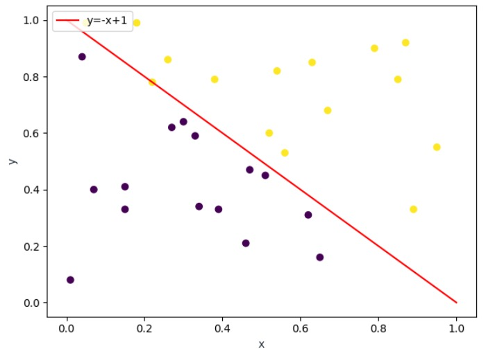

# Perceptron
The perceptron is an algorithm for supervised learning of binary classifiers. It has some limitations but is still worthy to be implemented. This project will dynamically show how the perceptron works in a two-dimensional space.

The 2D-data (points) processed must be linear separable for perceptron. So in this project, we randomly generated points (which are linear separable) as input. We use Python to find the plane which divids these points into two parts, and we record and visualize every step of this process.

## Data Set Generation

Because the data set must be linear separable. We randomly generated data $(x, y)$ point sets, where $0 ≤ x ≤ 1$ and $0 ≤ y ≤ 1$. Then we use $x + y = 1$ as the boundary to separate the data set.  

#### Attention

In order to reduce the steps to find the line which spilt two kinds of points apart, we use a pseudo-random algorithm to make all points have a certain distance from the boundary.

The result is shown below (Boundary is $x + y = 1$) :

# Attention
Because I'm a little bit buzy now, this project will finished later.

