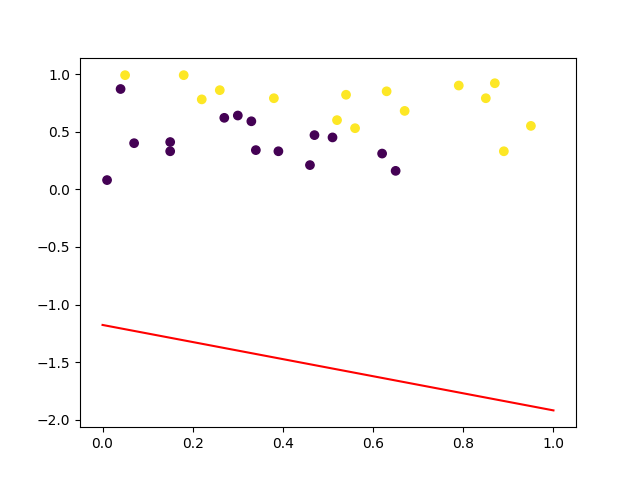

# Perceptron
The perceptron is an algorithm for supervised learning of binary classifiers. It has some limitations but is still worthy to be implemented. This project will dynamically show how the perceptron works in a two-dimensional space.

The 2D-data (points) processed must be linear separable for perceptron. So in this project, we randomly generated points (which are linear separable) as input. We use Python to find the plane which divids these points into two parts, and we record and visualize every step of this process.

## Data Set Generation

Because the data set must be linear separable. We randomly generated data $(x, y)$ point sets, where $0 ≤ x ≤ 1$ and $0 ≤ y ≤ 1$. Then we use $x + y = 1$ as the boundary to separate the data set.  

The result is shown below (Boundary is $x + y = 1$) :


# Algorithm
``` C
weight = (0, 0)
bias = 0
while (True)
	misclassified_count = 0
	for (x_i, y_i in D)
		if (y_i * transpose(weight) * x_i <= 0)	// misclassified
			weight = weight + y_i * x_i
			misclassified_count++
		endIf
	endFor
	if (m = 0)	break;
endWhile
```

# Result

The intermediate process of finding the boundary is recorded in the following figures.

### Step1 (of 13 steps)




### Step2


### Step3


### Step4


### Step5 to Step13


